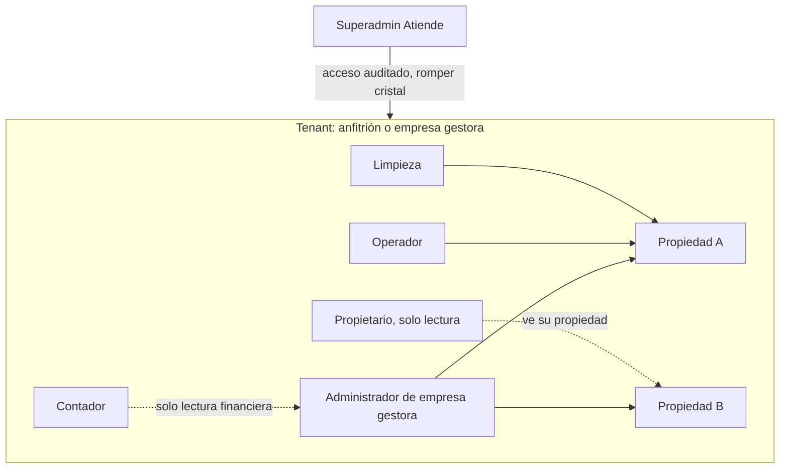
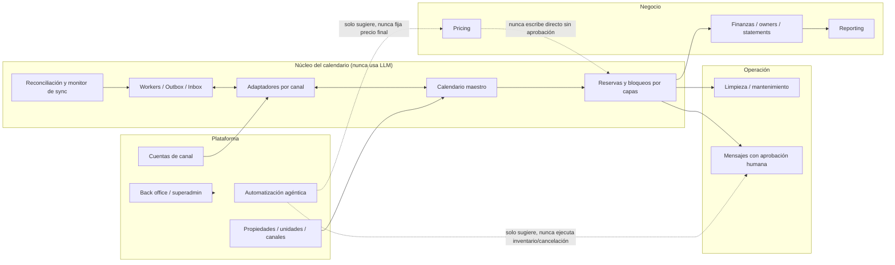
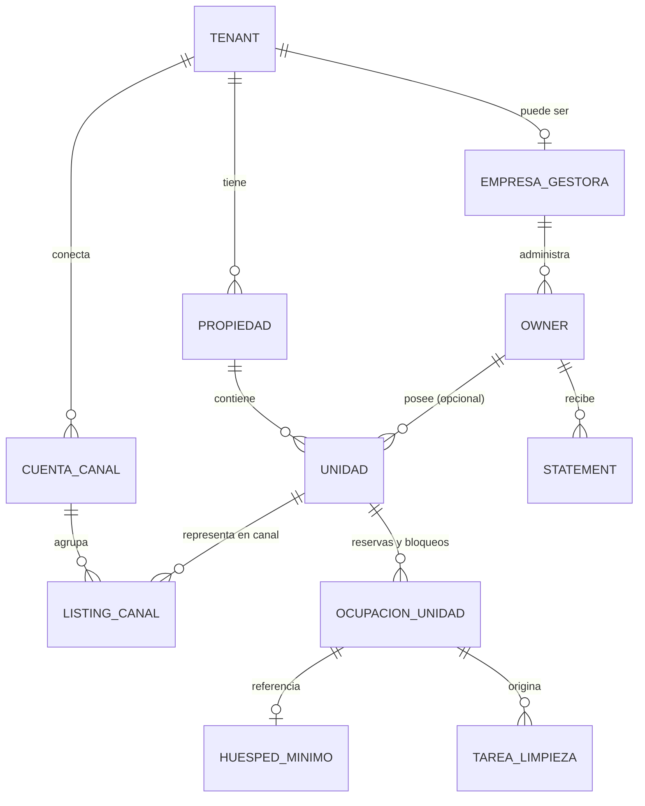
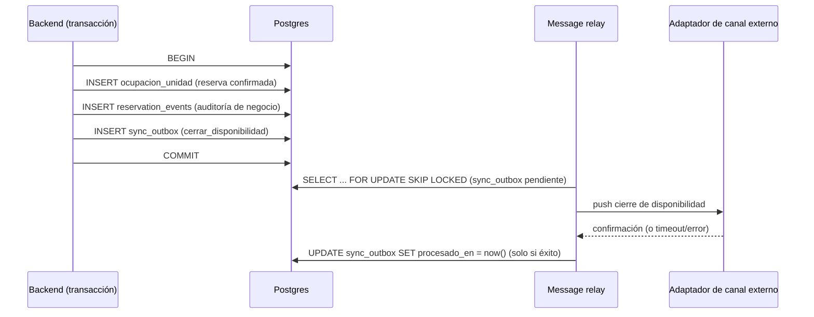
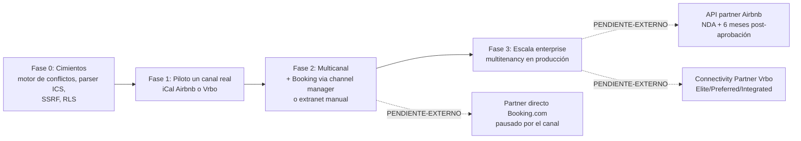

# Blueprint — Atiende Rentas Vacacionales

Calendario unificado multicanal para anfitriones, coanfitriones y
administradores profesionales de rentas vacacionales (Airbnb, Booking.com,
Vrbo y otros canales). Documento de arquitectura enterprise, construido
exclusivamente sobre la investigación de `docs/investigacion/RV01-RV21.md`,
el ledger de fuentes `docs/fuentes/*.md`, `docs/LAGUNAS.md` y
`docs/BLOQUEOS.md`. Toda decisión referenciada tiene su ADR en
`docs/DECISIONES.md` (D-nnn) y su requisito trazable en `docs/REQUISITOS.md`
(REQ-nnn). Nada en este documento sustituye la evidencia citada: donde la
investigación no llegó, se marca **PENDIENTE**, **SUPUESTO** o
**PENDIENTE-EXTERNO**, nunca se rellena por inferencia.

---

## 0. Visión y regla de dominio

Atiende Rentas Vacacionales resuelve un problema estructural del anfitrión,
coanfitrión o administrador que opera en más de un canal simultáneamente:
**ningún canal sabe, por sí mismo, qué pasa en los otros**. Airbnb, Booking.com
y Vrbo son, cada uno, una fuente de verdad parcial y aislada de disponibilidad,
y el mecanismo estándar de sincronización entre ellos (iCal/RFC 5545) es un
protocolo de *pull* con ciclos de horas, no un bus de eventos en tiempo real
(RV06, RV07). El resultado, sin intervención, es overbooking: la misma noche
vendida dos veces en dos canales distintos.

**Regla de dominio no negociable (aplica a todo el sistema, sin excepción):**

1. El calendario unificado **CIERRA disponibilidad entre canales** en cuanto
   detecta una reserva, y comunica honestamente la ventana de latencia real de
   esa propagación (D-003).
2. El sistema **nunca cancela una reserva confirmada** de forma automática
   (D-006, REQ-000).
3. El sistema **nunca contacta a un huésped** por iniciativa propia sin
   autorización humana explícita (D-006, REQ-001).
4. Ninguna capacidad de un canal que permita, técnicamente, cancelar o
   contactar de forma autónoma se traduce en una función del producto: se
   documenta como *capacidad existente en el canal que el producto decide NO
   usar* (regla de oro de `docs/investigacion/00-PLAN.md` §1.1).
5. La lógica de inventario/disponibilidad **nunca depende de un LLM** (D-007);
   la IA está separada de la lógica de inventario por diseño, no por
   configuración.

Todo módulo de este blueprint se evalúa contra estas cinco reglas antes que
contra cualquier otro criterio de producto.

---

## 1. Segmentos y roles

### 1.1 Perfiles de usuario (RV01)

La única categoría con evidencia primaria fuerte a la fecha de esta
investigación es **cohost/gestor por comisión** (Airbnb documenta su
Co-Host Network y tres niveles de permiso — RV01 art. 1534/3472). Las otras
tres categorías del marco de segmentación de negocio (anfitrión individual
1-3 unidades, administrador profesional 10-200 unidades, propietario pasivo)
son **hipótesis de segmentación de producto**, no categorías confirmadas por
ninguna plataforma investigada (RV01 §Supuestos). El producto se diseña para
las cuatro, pero solo la primera tiene respaldo documental directo hoy.

| Perfil | Evidencia | Volumen típico | Relación con el calendario |
|---|---|---|---|
| Anfitrión individual (propietario) | SUPUESTO de segmentación | 1-3 unidades | Dueño de la decisión; delega selectivamente |
| Cohost / gestor por comisión | [DATO] Airbnb Co-Host Network | Variable, por comisión | Opera con permisos delegados (3 niveles nativos de Airbnb) |
| Administrador profesional / PMC | SUPUESTO de segmentación | 10-200+ unidades, multi-ciudad | Opera como tenant con `empresa_gestora`; owners como terceros |
| Propietario pasivo | SUPUESTO de segmentación | 1+ unidad, delega todo | Rol "Propietario" de solo lectura (RV12 §1) |

### 1.2 Modelo de roles interno (RV12 §1, RV01)



Tres niveles de permiso de colaborador por propiedad, replicando los tres
niveles reales de Airbnb (REQ-011, REQ-012): **acceso total** (calendario,
mensajería, precios, reservas, cancelaciones); **calendario+mensajería** (ver
calendario, mensajear, sin editar ni cancelar); **solo calendario** (ver
únicamente). Solo el propietario de la propiedad configura o edita métodos de
pago de un colaborador (REQ-013) — restricción tomada literalmente de Airbnb
art. 1534, aplicada también internamente.

**Nunca se asume paridad de este modelo con Booking.com ni Vrbo** (REQ-018):
el modelo de roles de esos dos canales no pudo verificarse con fuente
primaria en esta investigación (bloqueos 403/429 sistemáticos, RV01 §Riesgos).

---

## 2. Mapa de módulos del producto



### 2.1 Calendario maestro

Vista unificada de ocupación por propiedad/unidad. No es una tabla física:
es una proyección sobre `reserva` + `bloqueo_manual` (D-012, RV17 §1.3). Debe
distinguir visualmente, por fecha y unidad (REQ-046): reserva confirmada,
bloqueo manual, bloqueo automático por regla, bloqueo por sincronización
externa — y mostrar la razón al seleccionar la fecha (RV09-R-01). Ofrece al
menos una vista de línea de tiempo multi-propiedad y una vista mensual de una
unidad, separando modo "ocupación" de modo "tareas operativas" (REQ-056,
patrón verificado en Hospitable).

### 2.2 Propiedades, unidades y canales

`propiedad` (con zona horaria IANA obligatoria, D-013) contiene 1..N
`unidad`. Cada `unidad` puede tener 0..N `listing_canal` (uno por canal
activo, con unicidad parcial sobre `(unidad_id, cuenta_canal_id) WHERE
activo`, RV17 §6.3). El modelo soporta explícitamente multi-unidad (varios
departamentos bajo una misma propiedad/edificio) y el mapeo hacia el
"listing representativo" que algunos canales exponen (Airbnb "multiple units
property", RV13 art. 4050; Booking.com `Quantity` a nivel de room type, RV04
F16) — REQ-071, REQ-136.

### 2.3 Cuentas de canal y matriz de conectividad por cuenta (estado honesto)

Cada `cuenta_canal` agrupa credenciales de un canal para un tenant. El estado
de conexión es un tipo cerrado, **nunca** optimista por defecto (D-017,
REQ-008):

```
no_conectado | iCal | partner_pendiente (bloqueado_por_partner) | sandbox | producción
```

`getConnectionState()` nunca devuelve `"producción"` sin evidencia
verificable reciente de sincronización real exitosa (RV17-R-09). La matriz de
conectividad por cuenta que ve un administrador es, por canal, algo así (los
valores de latencia/estado son los verificados en esta investigación, no
inventados):

| Canal | Vía | Estado posible | Latencia documentada | Evidencia |
|---|---|---|---|---|
| Airbnb | iCal | `iCal` activo | ~3h, ciclo automático [DATO, confianza **baja/media** para generalizar a cualquier conexión iCal producto-Airbnb — RV03 §Supuestos S1; latencia externa no controlada por el sistema] | RV03 F01, art. 99 |
| Airbnb | API partner | `partner_pendiente` → `sandbox` → `producción` | No documentada públicamente (webhooks no confirmados) [PENDIENTE] | RV03 §5, F10 |
| Booking.com | Extranet manual / iCal | `no_conectado` \| `iCal` (**estado real: SIN EVIDENCIA**) | **SIN EVIDENCIA** (elegibilidad y frecuencia no confirmadas, ni en vivo ni archivadas) | `docs/fuentes/b002-archivo.md` F07 |
| Booking.com | Channel manager certificado (tercero) | `producción` (vía intermediario, nunca directo) | Depende del channel manager | `docs/fuentes/b002-archivo.md` F02 |
| Booking.com | Partner directo (Connectivity API) | `partner_pendiente` — **pausa activa declarada por el canal** | No aplica (admisión cerrada) | `docs/fuentes/b002-archivo.md` F01 |
| Vrbo | iCal | `iCal` activo | ~30min + hasta 20min propagación [DATO] | RV05 |
| Vrbo | Connectivity Partner Program (Elite/Preferred/Integrated) | `partner_pendiente` → `producción` | No documentada (requisitos exactos por nivel no confirmados) | `docs/fuentes/b002-archivo.md` F05 (Wayback, confianza media) |
| Google Vacation Rentals | Feed estructurado, por invitación | `no_conectado` (roadmap) | No aplica hoy | RV05 |

**Nota crítica (evidencia de 2026-09-05, `docs/fuentes/b002-archivo.md`):**
Booking.com declara en vivo, en `connect.booking.com`: *"we are pausing
integrations with new connectivity providers until further notice"* [DATO,
F01] y que las propiedades individuales no pueden conectar directo vía API:
*"We don't accept direct connections from individual properties right now,
but you can connect via a channel manager"* [DATO, F02]. Esto cambia la
estrategia de conectividad (§7): para Booking.com, la matriz **nunca** muestra
"partner directo: pendiente de aprobación" como si fuera cuestión de tiempo —
muestra "partner directo: pausado por el canal", y la única vía de
integración más profunda que la extranet manual es un channel manager tercero
ya certificado (REQ-075, REQ-076, REQ-078).

### 2.4 Reservas y bloqueos por capas

Toda ocupación de una noche se modela con una razón tipada y precedencia
total: `RESERVA_CANAL > BLOQUEO_PROPIETARIO > MANTENIMIENTO >
BUFFER_LIMPIEZA` (D-002). Cancelar una razón de menor precedencia nunca
reabre una noche que otra razón de mayor precedencia todavía reclama
(REQ-006, REQ-035). Formalmente: `ocupado(unidad, noche) = ∃ bloqueo activo b
: noche ∈ [DTSTART(b), DTEND(b))`.

### 2.5 Adaptadores por capacidades

Cada canal se integra mediante un adaptador que declara honestamente sus
capacidades, nunca simula lo que no soporta (RV17 §6.1):

```ts
interface ChannelCapabilities {
  availabilityPush: boolean;
  ratesPush: boolean;
  reservationsPull: boolean;
  icalImportExport: boolean;
  messaging: boolean;
}
```

Si Booking.com no permite conexión directa individual, el adaptador de
Booking.com para un tenant sin channel manager certificado declara
`availabilityPush: false` para la vía directa, y expone únicamente la vía de
extranet manual (fuera del control programático de Atiende) o, si el tenant
ya usa un channel manager certificado como intermediario, delega hacia ese
adaptador de segundo orden.

### 2.6 Workers, outbox e inbox

Todo cambio de disponibilidad que deba propagarse a otros canales se encola
en la **misma transacción** que el cambio de negocio (`sync_outbox`, D-010).
Un worker de "message relay" procesa la tabla con `SELECT ... FOR UPDATE SKIP
LOCKED` y marca éxito solo tras confirmación real. Todo evento entrante
(webhook o resultado de polling) se procesa de forma idempotente por
`(canal, unidad, UID)` (REQ-036).

### 2.7 Reconciliación y monitor de sync con alertas

Reconciliación **incremental** (cada ciclo de polling, vía upsert) y
**completa** (periódica, comparando el conjunto de `UID`s del feed más
reciente contra los bloqueos activos de ese canal en la fuente de verdad,
RV07 §15) — la completa es la defensa contra pérdida silenciosa de un evento
`CANCELLED` que un ciclo incremental pudo no capturar. El monitor expone, por
canal y unidad: edad del último sync exitoso, drift detectado, conflictos
activos (REQ-038). Toda alerta termina en revisión humana o en una acción
reversible (pausar el push hacia un canal problemático); nunca en cancelar
una reserva (REQ-009, D-005).

### 2.8 Operación de limpieza/mantenimiento

El checkout dispara automáticamente una tarea de limpieza vinculada a la
reserva, con reprogramación si la fecha cambia (REQ-111, patrón verificado en
Breezeway/Hostaway/Guesty). El buffer de limpieza es su propio tipo de
bloqueo (`BUFFER_LIMPIEZA`, REQ-042). El vínculo "incidencia de mantenimiento
→ bloqueo automático de calendario" **no tiene precedente confirmado en
ningún proveedor de mercado investigado** (RV11 §e) — es una decisión de
diseño propia de Atiende, implementada como regla explícita y auditable,
nunca como cierre automático que además cancele reservas confirmadas
(REQ-118).

### 2.9 Mensajes con aprobación humana

El motor de mensajería soporta respuestas rápidas y programadas por evento
(REQ-099), replicando el modelo de Airbnb (quick replies, art. 2897-2899).
Ninguna respuesta generada por IA se envía sin aprobación humana explícita
previa (REQ-104, D-006) — declarado explícitamente como **decisión de
producto de Atiende**, no como política formal exigida por ningún canal
(RV10 §Supuestos): la función nativa de IA de Airbnb ya opera de facto con
intervención humana (solo sugiere), y el patrón de la industria (Hospitable,
Guesty) ofrece aprobación humana como modo por defecto con automatización
total como opción avanzada — Atiende nunca ofrece esa opción avanzada para
contacto directo a huéspedes.

### 2.10 Finanzas, owners y statements

`statement` se calcula por propietario y periodo a partir de `reserva`
(RV17 §1.1), nunca al revés. El motor distingue si el canal entrega el monto
ya neto de su comisión (Airbnb, confirmado: *"the entire fee is deducted from
the host's payout"*) o bruto (Booking.com/Vrbo, sin confirmar — REQ-121), para
evitar doble descuento. Los adaptadores de conciliación son por canal, no un
formato único, priorizando Vrbo (export CSV/XLS oficial confirmado) como caso
de referencia (REQ-124).

### 2.11 Pricing

El motor propio de reglas (base + estacionalidad + descuentos) solo se
sincroniza hacia un canal cuando existe integración API activa; para canales
solo-iCal, el pricing se gestiona desde Atiende o manualmente en el canal
(REQ-130) — iCal nunca transporta tarifa, confirmado por ausencia en RFC 5545
y en los artículos de ayuda de Airbnb/Vrbo leídos (RV13 §3). Al activar
pricing dinámico propio o de tercero, se desactiva explícitamente el pricing
nativo del canal (Smart Pricing/MarketMaker), dado que ambos anulan reglas
externas si quedan activos (REQ-133).

### 2.12 Reporting

Reportes financieros y operativos derivados de las mismas fuentes de verdad
(`reserva`, `statement`, `tarea_limpieza`) — sin duplicar lógica de cálculo
fuera de esas tablas. El reporting de latencia siempre descompone latencia
interna de latencia por canal (§9, REQ-039).

### 2.13 Back office / superadmin

Panel de plataforma multi-tenant para Atiende como proveedor: alta/baja de
tenants, soporte, acceso de "romper cristal" auditado, salud de integraciones
por canal a nivel agregado (RV12 §1). Nunca lectura de contenido de
conversaciones de huéspedes sin causa auditada.

### 2.14 Automatización agéntica con permisos en servidor, cuotas, trazabilidad y escalamiento

Ver §10 (sección dedicada, por ser transversal y de alto riesgo).

---

## 3. Arquitectura técnica y modelo de datos (RV17)

### 3.1 Entidades principales



`OCUPACION_UNIDAD` es la tabla única con discriminador `capa` (`reserva` |
`bloqueo`) que lleva el invariante de exclusión (D-002, RV17 §2.3 — la cita
correcta es §2.3; RV17 §1.1 describe en cambio `reserva`/`bloqueo_manual`
como dos tablas separadas, un modelo anterior no adoptado) — decisión
recomendada frente a dos tablas separadas, porque un `EXCLUDE` no puede
referenciar dos tablas distintas. **El invariante de exclusión de §3.2 aplica
únicamente a la capa `reserva` con `bloqueante=true`** (reservas confirmadas
y holds que efectivamente cierran la noche); nunca a `capa='bloqueo'`
(propietario/mantenimiento/buffer), que puede coexistir en filas solapadas y
se resuelve por precedencia + alerta, no por rechazo de base de datos — ver
el mecanismo completo en §3.2. Esta especificación resuelve la laguna
marcada en RV17 §13.4 sobre el detalle físico de "tabla única vs. dos
tablas", sujeta aún a la validación empírica end-to-end de D-012.

### 3.2 Invariante central: exclusión por rango, mecanismo de conflicto entre capas (corrección BC1)

```sql
CREATE EXTENSION IF NOT EXISTS btree_gist;

CREATE TABLE ocupacion_unidad (
    id              uuid PRIMARY KEY DEFAULT gen_random_uuid(),
    unidad_id       uuid NOT NULL REFERENCES unidad(id),
    during          daterange NOT NULL,        -- [check_in, check_out)
    capa            text NOT NULL,             -- 'reserva' | 'bloqueo'
    razon           text NOT NULL,             -- RESERVA_CANAL|BLOQUEO_PROPIETARIO|MANTENIMIENTO|BUFFER_LIMPIEZA
    canal_origen_id uuid REFERENCES canal(id),
    external_id     text,
    estado          text NOT NULL DEFAULT 'confirmado', -- 'confirmado'|'provisional'|'cancelado'|'conflicto_pendiente'
    bloqueante      boolean NOT NULL DEFAULT true,       -- ver nota de precedencia/EXCLUDE abajo
    version         integer NOT NULL DEFAULT 1,
    creado_en       timestamptz NOT NULL DEFAULT now(),

    -- El EXCLUDE corre SOLO sobre la capa de ocupación efectiva por unidad
    -- (reservas confirmadas y holds que sí cierran la noche, REQ-048).
    -- Bloqueos de propietario/mantenimiento/buffer (capa='bloqueo') NUNCA
    -- participan: pueden coexistir en filas solapadas entre sí y con una
    -- reserva; su conflicto se detecta y alerta, no se rechaza en el INSERT.
    EXCLUDE USING gist (
        unidad_id WITH =,
        during    WITH &&
    ) WHERE (capa = 'reserva' AND estado <> 'cancelado' AND bloqueante)
);

CREATE TABLE conflicto_calendario (
    id             uuid PRIMARY KEY DEFAULT gen_random_uuid(),
    unidad_id      uuid NOT NULL REFERENCES unidad(id),
    ocupacion_a_id uuid NOT NULL REFERENCES ocupacion_unidad(id),
    ocupacion_b_id uuid REFERENCES ocupacion_unidad(id), -- null si b fue rechazada por el EXCLUDE
    tipo           text NOT NULL,               -- 'capa_cruzada' | 'overbooking_confirmado'
    detectado_en   timestamptz NOT NULL DEFAULT now(),
    resuelto_en    timestamptz,
    resuelto_por   uuid REFERENCES usuario(id)
);
```

`daterange` normaliza automáticamente a la forma canónica `[)` (D-012,
RV17-F-04) — resolviendo por construcción el caso de estancias contiguas
(checkout de A el mismo día que check-in de B). Si el negocio exige hora
exacta de check-in/checkout, se usa `tstzrange` con el tercer argumento
`'[)'` forzado explícitamente en cada inserción (REQ-026), ya que PostgreSQL
no normaliza automáticamente ese tipo continuo.

Este constraint es una **composición razonada** de dos fuentes primarias
verificadas por separado (`CREATE TABLE ... EXCLUDE`, documentación oficial;
`btree_gist`, documentación oficial de la extensión), no una cita de un
ejemplo idéntico preexistente — **requiere validación empírica contra
`embedded-postgres` antes de considerarse verificado end-to-end** (D-012,
RV17 §11 riesgo #1).

**Mecanismo exacto de conflicto entre capas y comportamiento ante violación
del `EXCLUDE`** (la versión anterior de esta sección presentaba el SQL sin
reconciliarlo con D-002; esta es la corrección de la auditoría independiente,
BC1):

1. **Reserva vs. reserva (el overbooking real, único caso que no admite
   coexistencia)**: si dos filas `capa='reserva', bloqueante=true` de
   distinto canal intentan solaparse, el segundo `INSERT` viola el `EXCLUDE`
   y PostgreSQL devuelve la excepción `exclusion_violation` (`SQLSTATE
   23P01`). La aplicación **captura esa excepción en la misma transacción**,
   inserta la segunda ocupación con `estado='conflicto_pendiente'`
   (excluida del `EXCLUDE` por el `WHERE`, así que este segundo `INSERT` sí
   se acepta) y crea una fila en `conflicto_calendario`
   (`tipo='overbooking_confirmado'`), que dispara la alerta operativa de
   mayor severidad del sistema. Ninguna de las dos reservas se cancela
   automáticamente (REQ-000); un humano decide cuál se honra y cómo se
   resuelve con el canal correspondiente.
2. **Bloqueo de menor precedencia sobre una reserva, o dos bloqueos entre sí**
   (el ejemplo motivador de `RV07 §7`: *"una reserva confirmada y un bloqueo
   de mantenimiento superpuesto creado por error [...] la noche permanece
   ocupada por la reserva [...] se alerta el solapamiento [...] sin tocar la
   reserva"*): como `capa='bloqueo'` nunca participa en el `EXCLUDE`, el
   `INSERT` se acepta sin excepción de BD. Una verificación en la misma
   transacción (consulta contra filas activas solapadas de cualquier capa
   sobre la misma `unidad_id`) inserta una fila en `conflicto_calendario`
   (`tipo='capa_cruzada'`). La noche permanece ocupada por la razón de mayor
   precedencia en lectura (D-002); el bloqueo de menor precedencia queda
   persistido tal cual, visible y auditable — nunca oculto ni sobrescrito.
3. Ambos tipos de conflicto terminan siempre en revisión humana o en la
   pausa reversible de REQ-009/D-005; nunca en cancelación automática ni en
   contacto al huésped.

**Reconciliación con los estados de REQ-091 y la excepción de REQ-068/REQ-048**
(otra laguna que dejaba abierta la versión anterior de esta sección): el
campo `estado` distingue `confirmado` / `provisional` / `cancelado` /
`conflicto_pendiente` (cumple REQ-091: al menos tres estados), y el campo
independiente `bloqueante` decide si una fila participa del `EXCLUDE`. Una
solicitud pendiente que el canal de origen sí bloquea mientras espera
respuesta (Airbnb, REQ-048) se inserta como `estado='provisional',
bloqueante=true`. Una solicitud pendiente que el canal de origen **no**
bloquea (Booking.com `INQUIRY`/Request-to-Book, REQ-068) se inserta como
`estado='provisional', bloqueante=false`: queda registrada para trazabilidad
y para un eventual "bloqueo blando" interno (RV04-R-01, decisión de producto
pendiente), pero nunca puede rechazar por sí sola una reserva confirmada real
de otro canal.

### 3.3 Zona horaria por propiedad

`propiedad.zona_horaria` es una zona IANA obligatoria (`America/Cancun`,
`Europe/Madrid`); nunca un offset fijo (D-013). Toda columna operativa de
fecha/hora usa `timestamptz`; la conversión a hora local ocurre siempre en
lectura. El invariante de ocupación usa `date`/`daterange` por defecto,
evitando el problema de zonas horarias por completo para el cálculo de
noches.

### 3.4 Eventos y outbox transaccional



Si el worker muere entre el `push` y el `UPDATE`, el evento sigue pendiente y
se reintenta; la operación de aplicar un evento es un `upsert` por
`(canal, unidad, UID)`, no un `insert` — reintentar no duplica ni pierde el
efecto (D-010, REQ-041).

### 3.5 Multitenancy: RLS

```sql
create or replace function public.is_tenant_member(_user uuid, _tenant uuid)
returns boolean
language sql stable security definer set search_path = public
as $$
  select exists (
    select 1 from tenant_staff
    where user_id = _user and tenant_id = _tenant
  )
$$;

alter table ocupacion_unidad enable row level security;
alter table ocupacion_unidad force row level security;  -- si el rol de app es dueño de la tabla

create policy "tenant_staff_select" on ocupacion_unidad
  for select to authenticated
  using (public.is_tenant_member(auth.uid(), tenant_id));
```

Patrón verificado en código real de `atiende-restaurantes`
(`20260904050000_enterprise_tenant_isolation.sql`), preferido explícitamente
sobre un patrón alternativo (`current_tenant_ids()` sin parámetros) descrito
solo en prosa en el documento de referencia de Hoteles, por ser evidencia de
mayor confianza (D-020, RV17 §8.1). RLS es **fail-closed por defecto**: una
tabla con RLS habilitado y sin políticas es ilegible/inescribible
[DATO, RV17-F-05].

### 3.6 Auditoría

`audit_log` (tabla, fila, operación, actor, tenant, valores previos/nuevos,
timestamp), poblada por triggers en tablas sensibles (`ocupacion_unidad`,
`statement`, `cuenta_canal`). Distinta de `reservation_events` (específico
del agregado reserva, para reconstrucción de negocio) — RV17 §8.2, §5.1.

### 3.7 Decisión de stack

Backend Node/TS propio (Hono o Fastify) + JWT propio (`jose`) emitiendo los
mismos claims que ya consumen las políticas RLS de `atiende-restaurantes`, con
camino de convergencia hacia Supabase real en producción (D-009). Persistencia
híbrida: PGlite para pruebas unitarias/RLS rápidas, `embedded-postgres`
(Postgres 18.4 real) para pruebas de integración/concurrencia — verificado en
esta máquina que PGlite serializa toda concurrencia (1344 ms vs. 302 ms
medidos, RV17 §10.1) y por tanto **no sirve** para validar contención real del
invariante central (D-022).

---

## 4. Flujos críticos paso a paso

### 4.1 Reserva confirmada en Airbnb → cierre en Booking.com/Vrbo

1. El adaptador de Airbnb detecta una reserva confirmada (vía iCal import,
   ciclo ~3h de latencia externa no controlada, confianza baja/media para
   generalizar más allá de calendarios de terceros —RV03 S1—, o vía API
   partner si está aprobada).
2. En una única transacción: se inserta `ocupacion_unidad` (capa `reserva`,
   razón `RESERVA_CANAL`, `during=[check_in,check_out)`), se registra el
   evento en `reservation_events`, y se encola en `sync_outbox` un evento
   `cerrar_disponibilidad` con destino "todos los canales excepto Airbnb".
3. El worker de outbox procesa el evento: para Booking.com, si hay
   channel manager certificado conectado, delega el push a ese
   intermediario; si solo hay extranet manual, el cierre depende de que el
   anfitrión mantenga sincronización manual (limitación declarada, D-011).
   Para Vrbo, exporta el bloqueo vía el feed iCal propio de esa unidad/canal.
4. El feed de export de Atiende hacia Vrbo incluye el nuevo `VEVENT` con
   `UID` propio, namespaced (para anti-eco, D-004).
5. Vrbo lo importa en su propio ciclo (~30 min + hasta 20 min de propagación,
   RV05) — el sistema comunica esta ventana como "latencia por canal", no
   como "cierre instantáneo" (REQ-039).
6. Si Vrbo reexpone ese mismo bloqueo en su export (por ejemplo, si el
   anfitrión también lo importa de vuelta), el mecanismo anti-eco de tres
   capas lo descarta como eco, nunca crea un segundo bloqueo (D-004).

### 4.2 Cancelación que no reabre indebidamente

1. Airbnb reporta que el huésped canceló la reserva (o el host la canceló,
   con la penalización documentada — RV02, RV03 F18).
2. El sistema marca el bloqueo `RESERVA_CANAL` correspondiente como
   `cancelado`, **nunca de forma proactiva**: solo refleja lo que el canal ya
   hizo (REQ-044).
3. Antes de liberar las noches en la fuente de verdad, el motor evalúa si
   alguna otra razón de igual o mayor precedencia (otra reserva, un bloqueo
   de propietario, mantenimiento) todavía reclama esas noches (REQ-006). Si
   es así, la noche permanece ocupada por esa otra razón; el conflicto se
   inserta en `conflicto_calendario` (§3.2) y se reporta a un humano.
4. Solo si ninguna otra razón reclama esas noches se libera la disponibilidad
   y se propaga el cierre inverso ("liberar_disponibilidad") vía outbox hacia
   los demás canales.

### 4.3 Feed inaccesible → cuarentena

1. Un `GET` sobre el feed iCal de un canal falla (timeout, 5xx, DNS) o el
   `.ics` devuelto no parsea correctamente.
2. El sistema **nunca** interpreta esto como "el canal no tiene reservas"
   (D-005). El último estado válido conocido de ese canal/unidad se congela
   ("en cuarentena"), con timestamp del último éxito.
3. Se emite alerta operativa si la antigüedad supera el umbral configurable
   (propuesto 3× el ciclo esperado del canal, RV20 §2).
4. El runbook humano confirma si es un problema del canal externo o del
   propio conector; si es ambiguo, pausa el push automático hacia esa cuenta
   (acción reversible) y marca el calendario como "última disponibilidad
   conocida, no confirmada" en la UI, hasta que un ciclo exitoso posterior
   la reconfirme.

### 4.4 Modificación de fechas de una reserva existente

1. Llega un evento con el mismo `UID` pero rango distinto.
2. Si el nuevo rango **amplía** el anterior: el sistema verifica que las
   noches añadidas no estén ya ocupadas por otro bloqueo de razón distinta
   antes de aceptar la ampliación completa; si hay solapamiento, es un
   conflicto que se registra en `conflicto_calendario` (§3.2) y requiere
   alerta, nunca cancelación automática de la reserva ajena.
3. Si **reduce**: las noches que salen del rango se liberan solo si ninguna
   otra razón las reclama (mismo invariante de §4.2).
4. Si **se desplaza**: se trata como liberar el rango viejo (sujeto a la
   misma verificación) y ocupar el nuevo (sujeto a verificación de
   solapamiento). El efecto se recalcula noche por noche usando el modelo
   `[check_in, check_out)`.
5. En Airbnb, este flujo requiere aprobación explícita del host ("trip change
   request"); nunca se aplica automáticamente al calendario sin esa
   aprobación (REQ-064).

### 4.5 Estancias contiguas

Checkout de la reserva A el mismo día que check-in de la reserva B, misma
unidad: por construcción del modelo `[check_in, check_out)`, el día de
checkout de A no pertenece al rango de A (frontera exclusiva), y sí pertenece
al rango de B (frontera inclusiva) — ambos rangos son adyacentes, no
solapados, y el `EXCLUDE` los acepta sin error (D-012, RV17 §3). Un buffer de
limpieza adicional se modela como bloqueo `BUFFER_LIMPIEZA` independiente que
coexiste con este invariante sin contradecirlo (REQ-042).

### 4.6 Multi-unidad

Una propiedad con varias unidades reservables (departamentos de un edificio)
se modela con `unidad` independientes bajo la misma `propiedad`; el invariante
de exclusión corre por `unidad_id`, no por `propiedad_id` — dos unidades
distintas de la misma propiedad pueden reservarse independientemente sin
conflicto entre sí (RV17 §14, supuesto explícito). Hacia Airbnb, se mapea al
concepto nativo de "multiple units property" cuando aplica (REQ-136); hacia
Booking.com, al parámetro `Quantity` a nivel de room type (REQ-071).

---

## 5. Estrategia de conectividad por etapas (RV08, actualizado con B-002)

### 5.1 Qué SÍ se puede prometer hoy

- **iCal con Airbnb y Vrbo**, con latencia documentada por el propio canal
  (~3h Airbnb —confianza baja/media para generalizar más allá de calendarios
  de terceros, RV03 S1, latencia externa no controlada—; ~30min+20min Vrbo) —
  sin promesa de tiempo real (D-003).
- **Integración vía channel manager tercero certificado** (Guesty, Hostaway,
  Smoobu, OwnerRez — con API pública verificada, RV08 §2) como capa
  intermedia, incluyendo para Booking.com (única vía de conectividad
  programática mientras la admisión directa de partners esté pausada).
- **Extranet manual de Booking.com**, operada por el propio anfitrión, fuera
  del control programático de Atiende.

### 5.2 Qué NO se puede prometer hoy

- **Partner directo (Connectivity API) de Booking.com**: pausado por el
  propio canal desde una fecha no declarada, sin fecha de reapertura
  estimada [DATO, `b002-archivo.md` F01]. No se compromete ninguna fecha de
  lanzamiento de esta vía.
- **Conexión directa de una propiedad individual a Booking.com sin channel
  manager**: excluida por diseño del canal, no solo por proceso de
  aprobación [DATO, F02].
- **Frecuencia, elegibilidad o contenido del iCal de Booking.com**: sin
  evidencia primaria de ningún tipo (ni en vivo ni archivada; Wayback Machine
  no tiene ninguna captura histórica de `partner.booking.com`/
  `partnerhelp.booking.com`, F07). Ninguna cifra se presenta como verificada.
- **Webhooks en tiempo real de Airbnb**: solo confirmados por fuentes de
  terceros, no por documentación oficial de Airbnb accesible (RV03 F10).
- **Certificación Vrbo Elite/Preferred/Integrated con requisitos y costos
  exactos**: solo se confirma la existencia de los 3 niveles (captura
  archivada de 6 meses de antigüedad, confianza media, F05); requisitos
  exactos, costos y política de admisión de nuevos proveedores no
  confirmados.
- **Cero overbooking garantizado vía iCal**: matemáticamente inviable
  mientras el transporte sea polling con ciclos de horas (RV07 §9, RV21 §1).

### 5.3 Plan por fases (RV21 §6.1, con hitos de aprobación externa marcados)



Ningún hito marcado `PENDIENTE-EXTERNO` se reporta como "completado" sin
confirmación explícita del canal (correo/portal de aprobación como evidencia
— RV21 §6.2, criterio de aceptación #12).

---

## 6. Segmentación de mercado y modelo de negocio (contexto, RV15/RV16)

El mercado de referencia es de escala considerable pero con datos oficiales
desiguales por país: Airbnb reporta más de 5.5 millones de hosts globales
[DATO, comunicado Q2 2026]; Booking Holdings reporta ~3.9 millones de
alojamientos alternativos [DATO, 10-K FY2025]; España tiene una cifra oficial
del INE (341,001 viviendas turísticas, mayo 2026) que permite un SAM/SOM
estimado con supuestos explícitos ($7.7M–$71.6M USD/año de SAM, RV15 §5.1);
**México no tiene un equivalente oficial** y cualquier cifra de mercado para
ese país queda **PENDIENTE** hasta investigación de mercado primaria (RV15
§5.2). El modelo de negocio separa cuota base (lógica determinista) de un
add-on de IA conversacional facturado aparte (D-018), porque tienen perfiles
de costo estructuralmente distintos.

---

## 7. Seguridad, privacidad y legal (RV19) — requisitos de revisión

Esta sección enumera obligaciones que **requieren revisión legal/técnica
humana** antes de convertirse en compromiso de producto; ninguna se trata
como cerrada por esta investigación.

- **Seguridad técnica de ingesta no confiable**: SSRF (allowlist de esquema,
  deny-list de metadata cloud/rangos privados, sin redirects automáticos —
  REQ-030), límites propios de tamaño/recurrencia del parser ICS (REQ-031,
  sin cifra prescrita por ningún estándar u OWASP), secretos cifrados en
  reposo con rotación (REQ-141), logs sin PII (REQ-142).
- **Protección de datos de huéspedes**: LFPDPPP en México (autoridad de
  aplicación cambiada de INAI a la Secretaría Anticorrupción y Buen Gobierno,
  con el Reglamento de 2011 desactualizado respecto a la ley 2025 — laguna
  crítica de vigencia); RGPD en España/UE (transferencias internacionales a
  terceros países como punto de revisión legal obligatorio si hay proveedores
  fuera de UE/EEE).
- **Registro de viajeros y de anuncios**: RD 933/2021 en España (retención 3
  años, comunicación en 24h) con la Orden INT del modelo operativo vigente
  **no confirmada**; Reglamento UE 2024/1028 sobre número de registro en
  anuncios, condicional a que el Estado miembro active el régimen (Art. 4.2)
  — **no confirmado si España lo activó ni si existe el Real Decreto de
  transposición** (laguna crítica, bloquea la funcionalidad hasta
  verificación directa — REQ-153).
- **Obligaciones fiscales México**: retención de ISR (4%/20%) e IVA
  (50%/100%) por la plataforma (Airbnb/Booking), con laguna de vigencia
  post-2024/2021 no verificable por bloqueo de acceso a sat.gob.mx
  (`docs/BLOQUEOS.md` B-005) — ninguna calculadora fiscal se libera sin esa
  verificación y revisión de contador (D-023, REQ-126).
- **Regulación local no verificable**: CDMX (`docs/BLOQUEOS.md` B-004) queda
  bloqueada por completo hasta verificación manual directa en la Gaceta
  Oficial.
- **Términos de uso de canales**: prohibición explícita de scraping/
  automatización de sesión (Airbnb ToS §11.1, Booking.com T&C A15.2/A15.3);
  el producto usa exclusivamente feeds iCal públicos, APIs certificadas o
  programas de partner reconocidos (REQ-010).

---

## 8. Operación y observabilidad (RV20)

Caso ancla usado para calibrar SLOs: administrador de portafolio pequeño
(10-20 unidades, 3 canales, guardia humana de horario extendido, no 24/7
dedicado). Instrumentación basada en tipos de OpenTelemetry (Counter,
Histogram, UpDownCounter, Gauge asíncrono — REQ-156/157). SLO interno
propuesto: p95 < 5s / p99 < 15s para el ciclo webhook→escritura→confirmación
(el camino que el sistema controla); **ningún SLA se publica sobre la
disponibilidad/latencia de las APIs de canal**, que están fuera de control
del producto (REQ-158). "Logs sin PII" se declara explícitamente como
decisión de producto, no como mandato de OpenTelemetry (D-021, verificado
leyendo directamente dos páginas independientes de la especificación).
Backups: completo diario + WAL continuo, retención 35 días + 12 meses
mensual, con prueba de restauración mensual obligatoria (REQ-159); todo
restore va seguido de reconciliación de drift antes de reanudar push
automático (REQ-160, riesgo de "reservas fantasma" por outbox reproducido no
idempotente). Migraciones: patrón expand/contract, nunca bloqueantes en
horario de check-in/checkout (REQ-162). Feature flags: default `false` para
toda funcionalidad que module dinero, cancelaciones o contacto a huéspedes
(REQ-163, patrón BP-163 de la línea de producto Hoteles). Simuladores de
canal en desarrollo llevan nombre inequívoco y rechazan arranque si las
credenciales parecen de producción real (D-019, REQ-164).

---

## 9. Pruebas y aceptación (RV21) — resumen

Ver `docs/ACEPTACION.md` para el detalle completo con comando/evidencia
esperada por criterio. Resumen de niveles: unitarias (lógica pura, sin I/O),
integración (parser ICS real + BD real), contratos por adaptador (fixtures
grabados de comportamiento documentado), E2E, **adversariales** (catálogo
obligatorio de 20 casos — UID reciclado, doble reserva, feed malformado, DST,
SSRF, aislamiento multitenant, entre otros), carga (objetivos fijados
empíricamente en piloto, nunca asumidos a priori). Medición de latencia
siempre descompuesta en interna (controlable) vs. por canal (no controlable) —
REQ-039.

---

## 10. Automatización agéntica: permisos en servidor, cuotas, trazabilidad, escalamiento

Dos categorías estrictamente separadas (RV18 §2):

**Automatizaciones deterministas (sin LLM en ningún punto):** mensajes
programados a huéspedes con opt-in por plantilla/canal, turnos de limpieza
generados por reglas de calendario, alertas de desincronización (drift) entre
canales. Si algo falla, falla como un bug de software convencional, nunca
como una alucinación de modelo.

**Agentes LLM (con supervisión humana obligatoria):** borrador de respuesta a
huéspedes (el humano debe pulsar "enviar"; el agente nunca tiene una tool de
envío directo), resumen de incidencias (borrador editable, no dispara
acciones), sugerencia de precio (nunca se aplica automáticamente; se escribe
con una tool determinista separada tras confirmación humana).

**Defensas estructurales, no solo de proceso:**

1. **Cero identificadores como parámetro del modelo** (D-008): ninguna tool
   declara `tenant_id`/`propiedad_id`/`huesped_id`/`reserva_id` en su
   `input_schema`; el servidor los resuelve desde el `ToolContext` de la
   sesión autenticada. Razón: la única defensa que Anthropic documenta como
   sólida contra inyección de prompt cuando el atacante potencial es el
   propio interlocutor autorizado (el huésped) es la del entorno/servidor,
   no la del modelo [DATO, RV18-F-02].
2. **Cero tools de acción irreversible**: `cancelar_reserva` y
   `contactar_huesped_directo` no existen en el catálogo de tools de ningún
   agente, bajo ninguna condición (D-006, REQ-002).
3. **Presupuesto duro de IA por tenant**, reservado antes de cada llamada, no
   facturado después (D-016).
4. **Trazabilidad de cada tool-call**: actor humano, rol, canal, timestamp,
   resultado, costo atribuido al modelo real (no nominal) que respondió esa
   ronda (REQ-145).
5. **Escalamiento obligatorio a humano** ante ambigüedad no resuelta,
   escalada emocional del huésped, montos por encima de umbral, o cualquier
   acción irreversible (REQ-146).
6. **Verificación en CI, no solo en revisión de código**: pruebas que fallan
   si una tool de mutación sensible declara un identificador en su schema, si
   una escritura de disponibilidad ocurre fuera de transacción, o si aparece
   una tool de cancelación/envío directo en el registro accesible a un agente
   (RV18 §8).

La autonomía plena de envío sin aprobación humana **está fuera de alcance de
producto por regla de negocio**, no es un nivel que se alcance con más evals
(REQ-147) — RV14 confirma que ningún competidor investigado declara esta
combinación (aprobación no-opcional + trazabilidad + permisos server-side +
estado de sync honesto) como conjunto, lo que la convierte en el diferencial
más defendible de Atiende frente al mercado.

---

## 11. Diferenciación de mercado (RV14)

De 10-11 competidores investigados con página oficial leída (Guesty,
Hostaway, OwnerRez, Smoobu, Uplisting, Beds24, Hospitable, Hostfully, iGMS,
Rentals United, más Lodgify con confianza baja), **ninguno** declara
públicamente la combinación: aprobación humana no-opcional y transversal +
audit log de acciones de IA + permisos de agente limitados en servidor +
estado de sincronización honesto (mostrando fallos/conflictos, no solo
"verde"). Guesty (el más agresivo en autonomía de IA) solo pide aprobación
humana en casos puntuales (reviews negativas); Hospitable retira la
aprobación por completo en su tier superior ("fully automated"). Este hueco
de mercado, verificado a 2026-09-05 en el discurso público de estos
proveedores (no en su código interno, que no fue auditado), es la base de la
propuesta de valor diferenciada de Atiende (§10).

---

## 12. Riesgos y mitigaciones

| Riesgo | Probabilidad | Impacto | Mitigación |
|---|---|---|---|
| Booking.com no reabre admisión de partners directos indefinidamente | Media-alta (pausa activa sin fecha) | Alto para el roadmap de conectividad profunda con Booking | Depender de channel manager certificado como intermediario (D-011); comunicar honestamente esta limitación a clientes |
| Ventana de doble reserva vía iCal nunca llega a cero mientras el transporte sea polling | Alta (estructural) | Alto (overbooking es la promesa central rota) | Comunicación honesta de latencia (D-003); anti-eco y cuarentena (D-004/D-005); priorizar API certificada para canales de alto volumen cuando se apruebe |
| Falla de aislamiento multitenant (RLS mal configurado, `FORCE ROW LEVEL SECURITY` omitido) | Media | Crítico (overbooking cruzado entre tenants, fuga de datos) | RLS fail-closed verificado contra código real (D-020); suite de pruebas de privilegios cross-tenant en CI (REQ-140) |
| Inyección de prompt vía mensaje de huésped que induzca a un agente a revelar datos de otro tenant o simular una cancelación | Media | Alto | Cero identificadores como parámetro del modelo (D-008); cero tools de acción irreversible (D-006); verificación en CI |
| Laguna legal de México/España se resuelve tarde y bloquea funciones ya comunicadas comercialmente | Media | Alto (riesgo legal/reputacional) | Ninguna funcionalidad fiscal/legal se libera sin verificación + revisión humana (D-023); campos opcionales sin afirmar fundamento legal hasta confirmación (REQ-153) |
| `embedded-postgres` bajo Rosetta 2 se vuelve cuello de botella en CI frecuente | Baja-media | Medio (velocidad de desarrollo) | Vigilar tiempos; investigar build arm64 nativa si se vuelve bloqueante (RV17 §11) |
| Costo de IA por conversación excede lo modelado (supuesto de 2,000/500 tokens no validado con producción real) | Media | Medio (margen) | Telemetría de consumo desde el lanzamiento (REQ-176); presupuesto duro por tenant (D-016) |
| Un simulador de canal en desarrollo se confunde con producción y genera decisiones operativas sobre datos ficticios | Baja | Alto si ocurre | Nombre inequívoco + rechazo de arranque con credenciales sospechosas de producción (D-019) |
| Vrbo cambia los requisitos/nombres de sus niveles de Connectivity Partner sin aviso (evidencia de 6 meses de antigüedad) | Media | Bajo-medio | No usar la evidencia archivada como base de un contrato comercial; reverificar antes de comprometer un nivel específico (REQ-085) |
| Umbral de elegibilidad de Request-to-Book de Booking.com no reconciliado entre dos páginas oficiales ("al menos 3 días" F04 vs. "más de 48 horas" F13, RV04 §7) lleva a diseñar mal la ventana de "bloqueo blando" interno propuesta en RV04-R-01 | Baja-media | Medio (afecta REQ-068, riesgo de overbooking cruzado en la ventana RtB) | No usar ningún número concreto en copy de producto/SLA sobre esta ventana hasta aclaración por soporte oficial de Booking.com (RV04 §7); mientras tanto, aplicar el umbral más conservador (72h) al decidir si se activa un bloqueo blando propio |

---

## 13. Plan enterprise por fases

| Fase | Alcance | Depende de aprobación externa | Criterio de salida |
|---|---|---|---|
| Fase 0 — Cimientos | Motor de conflictos UID/SEQUENCE/DTSTAMP, parser ICS con límites propios, controles SSRF, RLS/aislamiento multitenant | No | Pasa el catálogo adversarial completo (20 casos) en un canal simulado |
| Fase 1 — Piloto de un canal real | Airbnb o Vrbo vía iCal, grupo reducido de propiedades reales | No | Latencia por canal medida con datos reales (p50/p95/p99), catálogo adversarial pasa con datos reales de al menos un canal |
| Fase 2 — Multicanal | Segundo canal; para Booking.com, vía channel manager certificado o extranet manual (partner directo pausado) | **Sí, para Booking.com** (channel manager certificado por Booking) | Catálogo adversarial re-ejecutado en escenario multicanal real (doble reserva cross-canal real, no solo simulada) |
| Fase 3 — Escala/enterprise | Multitenancy en producción, SLOs validados con datos reales, RACI operativo | **Sí, para conectividad directa certificada** (Airbnb API partner, Vrbo Elite/Preferred/Integrated, Booking.com si reabre admisión) | Cero incidentes de fuga cross-tenant en la suite de aislamiento durante el piloto; ninguna laguna legal crítica de la jurisdicción del piloto sin decisión documentada |

Matriz RACI mínima (RV21 §6.5): ingeniería es responsable de límites técnicos
del importador y controles de seguridad; producto es responsable de avisos de
privacidad y flujos ARCO/RGPD, aprobados por legal/compliance; dirección de
producto/negocio es responsable de solicitar y gestionar certificaciones de
partner, aprobadas por dirección.

---

## 14. Lagunas que condicionan el diseño

Ver `docs/LAGUNAS.md` (matriz completa por canal × método) y
`docs/BLOQUEOS.md` (bloqueos activos con intentos documentados). Las lagunas
de mayor impacto para este blueprint:

- **iCal de Booking.com**: sin evidencia primaria de ningún tipo sobre
  elegibilidad, frecuencia o contenido — bloquea cualquier compromiso de
  latencia para ese canal por esa vía (`docs/fuentes/b002-archivo.md` F07).
- **Requisitos exactos por nivel del Vrbo Connectivity Partner Program**:
  solo confirmados los nombres de los 3 niveles, con evidencia archivada de 6
  meses de antigüedad (F05).
- **Registro Único de Arrendamientos español**: no confirmada la existencia
  del Real Decreto de transposición ni la Orden INT del modelo operativo del
  parte de viajeros (`docs/BLOQUEOS.md` B-003).
- **Regulación local de CDMX**: no verificable por bloqueos técnicos de
  acceso (`docs/BLOQUEOS.md` B-004).
- **Vigencia de tasas de retención fiscal en México (ISR/IVA) post-2024/2021**:
  sat.gob.mx inaccesible como SPA en esta investigación (RV19 §6.4,
  `docs/BLOQUEOS.md` B-005).
- **Webhooks reales de Airbnb**: solo confirmados por fuentes de terceros, no
  por Airbnb directamente (RV03 F10).
- **Modelo de roles de Booking.com y Vrbo**: no verificado con fuente
  primaria (bloqueos 403/429 sistemáticos, RV01).
- **Carpeta de trabajo del proyecto**: `docs/BLOQUEOS.md` B-001, sin impacto
  en el contenido de este blueprint pero pendiente de resolución
  administrativa con el usuario.

Ningún hito del plan de fases (§13) que dependa de estas lagunas se marca
como completado sin resolverlas primero.
